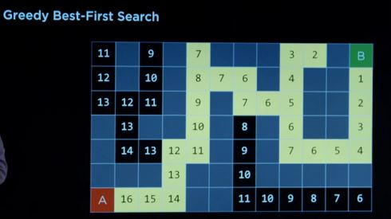
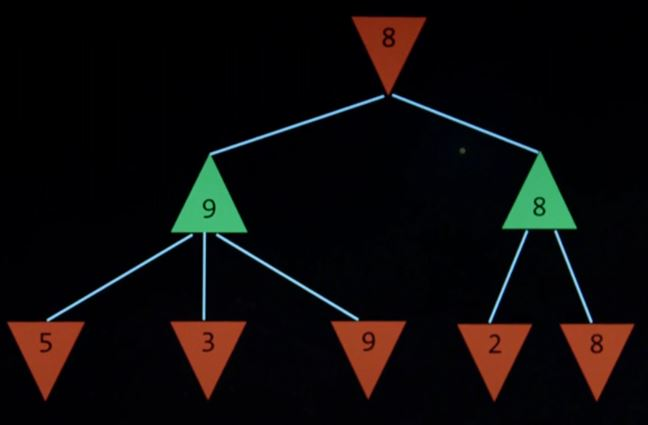

# Search
## 1 Search Problems
### 1.1 Terms
- **initial state**: the state where the agent begins
- **actions**: choices that can be made in a state. 
    - It is usually defined as a function, **ACTIONS(s)** returns the set of actions that can be executed in state s.
- **transition model**: a description of what state results from performing any applicable action in any state
    - It is usually defined as a funtion, **RESULT(s,a)** returns the state resulting from perfroming action a in state s.
- **goal test**: way to determine whether a given state is a goal state
- **path cost function**: numerical cost assocaited with a given path
### 1.2 Data structure --> To package and track the whole bunch of above data 
**node**, a data structure that keeps track of 
- a state
- a parent (node that generated this node)
- an action (action applied to parent to get node)
- a path cost (from initial state to node)
### 1.3 Solving Search Problems
- Start from a frontier that contains the initial state only
    - frontier: all of the things that we could explore next, that we haven't yet explored or visited
- **Start with an empty explored set.**
- Repeat:
    - If the fontier is empty, then no solution.
    - Remove a node from the frontier. 
      *NOTE: The way we treat frontier, impacts the algorithm we use to remove that node. It could be either a stack data structure or a queue data structure. See details in Seach Algorithm.*
    - If a node contains goal state, return the solution.
    - **Add the node to the explored set.**
    - Otherwise, expand node, add resulting nodes to the frontier **if they aren't already in the frontier or the explored set.**
        - *expand node, a term in AI, means to look at all of the neighbours of that node, or to consider all of the possible actions  .*
## 2 Search Algorithm
To find an optimal solution that leads from the initial state to a goal state with the lowest path cost
### 2.1 Classical Search
#### 2.1.1 Uninformed Search
A search strategy that uses no problem-specific knowledge.
- **DFS (Depth-First Search)**
A search algorithm that always expands the **deepest** node in the frontier.
It uses a **stack** data structure -- last in, first out.
*Note: It is possible that DFS might not find the optimal solution.*
- **BFS (Breadth-Frist Search)**
A search algorithm that always expands the **shallowest** node in the frontier.
It uses a **queue** data structure -- first in, first out.
#### 2.1.2 Informed Search
A search stratrgy that uses problem-specifc knowledge.
- **Greedy Best-First Search**
A search algorithm that expands the node that is closet to the goal, as estimated by a heuristic function h(n). 
    - Heuristic funtion is also called Manhatten distance, where the heuristic is how many squares vertically and horizontally to get from each of these cells to the goal, or in short terms, the geographical distance to the goal.

*Note: The search algorithm is not going to know for sure whether it is the closest thing to the goal, it is just esimating. So how good is the heuristic is, is going to affect how good this algorithm is.*

- **A* Search**
A search algorithm that expands node with lowest value of g(n) + h(n), wherein,
    - g(n) = cost that has already been taken to the current node, 
    - h(n) = estimated cost to goal.

### 2.2 Adversarial Search
#### 2.2.1 Minimax
Minimax represents winning conditions as -1 for one side and +1 for the other side. The minimising side trys to get the lowest score, and the maximiser trys to get the highest score. It could also be called a recursive algorithm
- S0: Initial state
- Player(s): returns which player to move in state s
- Actions(s): returns legal moves in state s
- Result(s,a): returns state after action a taken in state s
- Terminal(s): checks if state s is a terminal state
- Utility(s): final numerical value for terminal state s

Pseudocode:
- Given a status s:
    - MAX picks action *a* in ACTIONS(s) that produces **highest** value of MIN-VALUE(Result(s,a))
    - MIN picks action *a* in ACTIONS(s) that produces **smallest** value of MAX-VALUE(Result(s,a)) 
- Function Max-Value(state)
    - v = -∞

 #### 2.2.2 Alpha-Beta Pruning - Optimization to Minimax
 
 
 #### 2.2.3 Depth-Limited Minimax 
 The original Minimax is depth-unlimited until we get to the end of the game. While depth-limited minimax is going to stop and not consider additional moves that might come after certain movements ahead.
